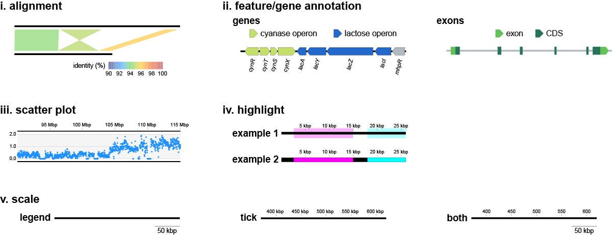
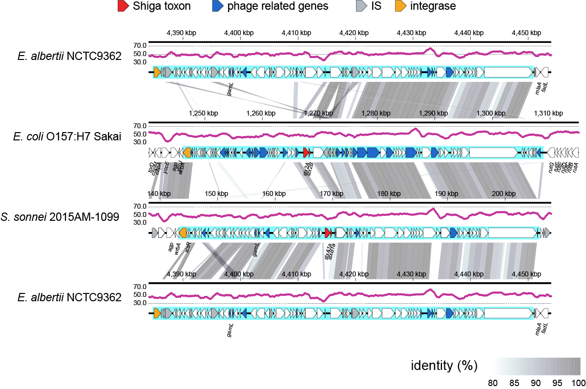
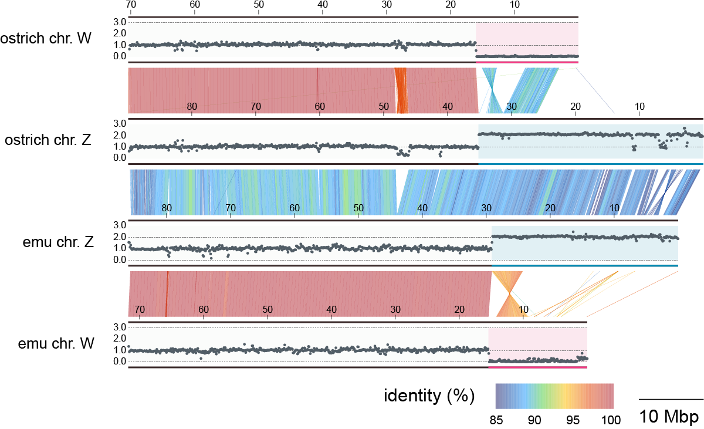
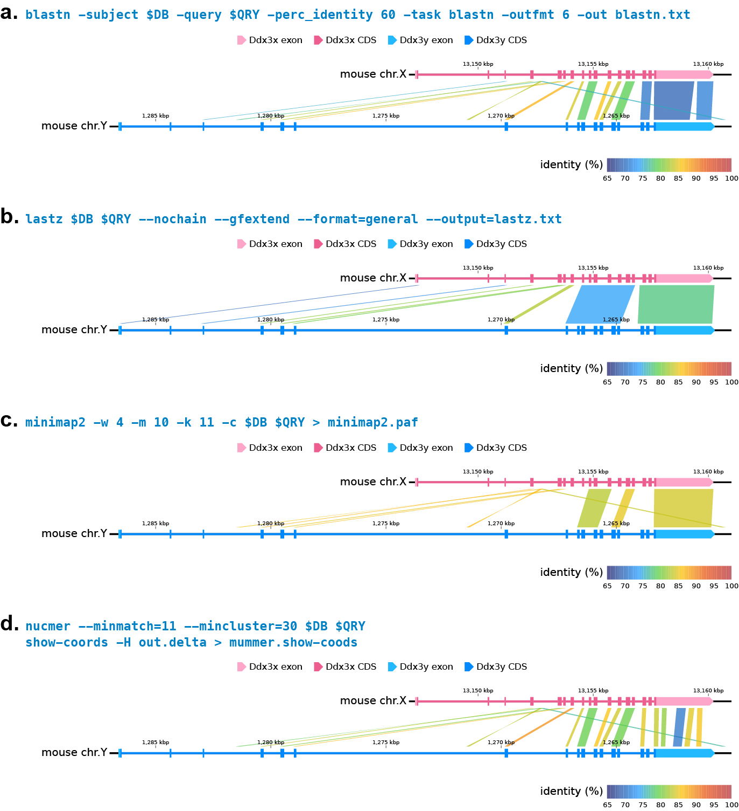
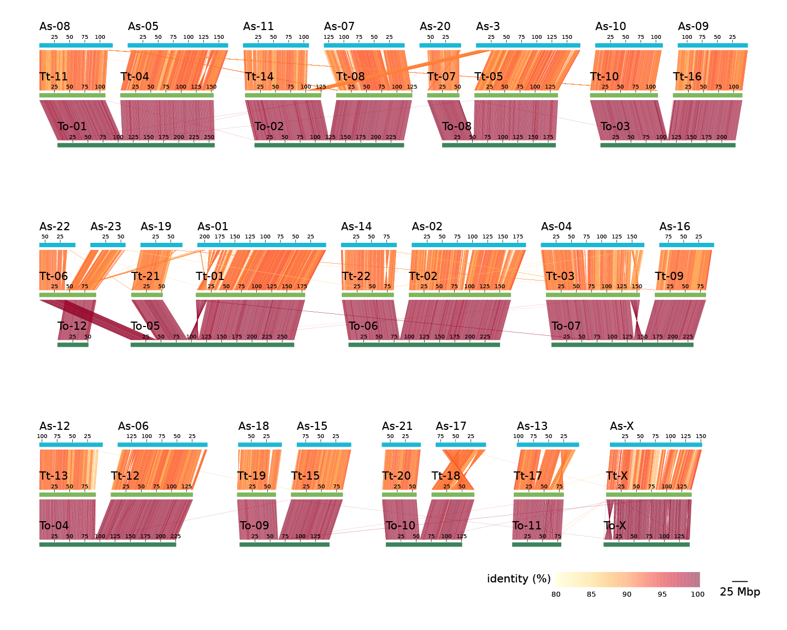

# a-liner
This repository contains the `a-liner` script and sample data.  
Overview of visualization components supported by a-liner.



## Contents
- [Requirements](#requirements)
- [Installation](#installation)
- [Sample Data](#sample-data)
- [Options](#options)
- [Prepare input files](#prepare-input-files)
- [Usage from Python](#usage-from-python)
- [Citation](#citation)

## Requirements
This project has been tested with the following environment:
- `python 3.13.5`
- `matplotlib 3.10.3`
- `pandas 2.3.1`
- `numpy 2.3.2`
- `biopython 1.85`
- `bcbio-gff 0.7.1`
- `openpyxl 3.1.5`


## Installation
### Install via Bioconda
```
conda install -c bioconda a-liner
```
> Note: If you haven't configured Bioconda before, follow the instructions [here](https://bioconda.github.io/) to set up the necessary channels.

### Install from source (development / GitHub)
```
git clone https://github.com/mokuno3430/a-liner.git
cd a-liner
pip install -e .
```
This installs `a-liner` in editable mode, allowing you to modify the source code while using the command-line interface.

Required dependencies:
```
conda install "python>=3.8" matplotlib numpy pandas "biopython>=1.80" bcbio-gff openpyxl
```

## Sample Data
This repository includes two example datasets demonstrating different use cases of a-liner.  
Each example directory contains a `runme.sh` script that reproduces the figure shown in the paper.  

### Example 1: Bacterial Stx phages (local-scale comparison)

This example demonstrates a linear comparison of Shiga toxin–encoding phages in Escherichia coli, focusing on mobile genetic elements at a local genomic scale.

```
cd sample_data/a_Stx-phages
bash runme.sh
```

This command generates a PDF file (`Stx-phage_loci.pdf`) visualizing:
- sequence alignments generated by BLASTN
- gene annotations
- user-specified highlighted regions on sequence tracks
<p align="center">

</p>

### Example 2: Ostrich–emu chromosomes (chromosome-scale comparison)

This example demonstrates chromosome-scale alignment visualization between ostrich and emu sex chromosomes.

```
cd sample_data/b_ostrich-emu
bash runme.sh
```

This command generates a PDF file (`ostrich-emu_sex-chromosomes.pdf`) showing:
- large-scale sequence alignments generated by minimap2
- scatter plots of quantitative features (e.g., estimated copy number)
- user-specified highlighted regions on sequence tracks and scatter-plot backgrounds
<p align="center">

</p>

### Additional examples (Supplementary datasets)
Additional reproducible examples are available in the supplementary datasets archived on Zenodo:  
[](https://doi.org/10.5281/zenodo.19695796)

This example demonstrates exon–intron visualization together with comparative genomic alignments at the _Ddx3x_ and _Ddx3y_ loci in mouse.
<p align="center">

</p>

This example demonstrates the placement of multiple sequences on a single track, enabling chromosome-to-chromosome comparisons and visualization of one-to-many relationships.
<p align="center">

</p>

## Options
### General options
```
  -h, --help            show this help message and exit
  -i, --input file      File(s): sequence info for display.
                        Format: tab-delimited with columns [n, seq_ID, start(1-based), end(1-based), strand(+ or -), display name]
  --xlsx Excel          File: seq_info.xlsx
  --xlsx_sheet str      sheet name of seq_info.xlsx
  --out str             Optional: prefix of PDF file (default: out).
  --figure_size width height
                        Optional: figure size as [width height](inch).
                        If width=0 → set to 6. If height=0 → auto(default: [6, 0]).
  -v, --version         show program's version number and exit
```

### Sequence layout options
```
  --seq_layout {left,center,right}
                        Optional: sequence layout (default: left).
  --margin_bw_seqs float
                        Optional: vertical margin between adjacent sequences. Default -1 means auto-adjust.
  --xlim_max int        Optional: maximum x-axis coordinate for plotting (bp). Default -1 means auto-adjust.
  --left_margin float   Optional: left side margin of the figure.
                        Default -1 means auto-adjust. range 0.05-0.50.
```

### Sequence drawing options
```
  --seq_color str       Optional: color of sequences (default grey).
  --seq_font_size float Optional: font size of sequence names (pt). Default 6.
  --seq_thickness float Optional: thickness of sequence lines (pt) (default: 1.5).
```

### Sequence scale options
```
  --scale {legend,tick,both}
                        Optional: how to display scale.
                        "legend" = show scale bar, "tick" = show axis ticks on sequences,
                        "both" = show both (default: legend).
  --tick_width int      Optional: scale width of axis (bp) (default -1 means auto).
  --tick_font_size float
                        Optional: font size of ticks (pt) (default: 3).
```

### Sequence alignment files
```
  -a, --alignment [file ...]
                        File(s): custom alignment data.
                        Format: tab-delimited with columns [seq_ID1, start1, end1, seq_ID2, start2, end2, identity(%)].
  --blastn [file ...]   File(s): blastn output.
                        Example: blastn -db ref.fa -query query.fa -out blastn.txt -outfmt 6
  --lastz [file ...]    File(s): lastz output.
                        Example: lastz ref.fa query.fa --format=general --output=lastz.txt
  --mummer [file ...]   File(s): MUMmer show-coords output.
                        Example: show-coords -H out.delta > show-coords.tsv
  --minimap2 [file ...]
                        File(s): minimap2 PAF output.
                        Example: minimap2 -c ref.fa query.fa > out.paf
```

### Sequence alignment options
```
  --min_identity int    Optional: minimum sequence identity (%).
                        Alignments below this threshold will be ignored (default: 70).
  --min_alignment_len int
                        Optional: minimum alignment length (bp).
                        Alignments shorter than this will be ignored (default: 0).
  --alignment_alpha float
                        Optional: transparency (alpha) of alignment coloring, range 0–1
                        (0 = fully transparent, 1 = opaque) (default: 0.5).
  --colormap {0,1,2,3,4,5}
                        Optional: colormap for sequence identity.
                        0 = bone_r, 1 = hot_r, 2 = BuPu, 3 = YlOrRd, 4 = YlGnBu, 5 = rainbow (original) (default: 5).
  --include_nonadjacent Include alignments between non-adjacent sequences (default: only adjacent).
```

### Gene annotation files
```
  --gff3 [gff3 ...]     File(s): gene annotation in GFF format.
  --gff_xlsx [Excel ...]
                        File(s): GFF format in Excel files
  --gb [genbank ...]    File(s): genbank format.
```

### Gene / feature legend options
```
  --feature_color_map FILE
                        TSV file specifying feature labels, matching keywords, and colors. 
                        Features matching the keywords will be colored accordingly and shown in the legend.
  --feature_color_legend_font_size float
                        Optional: font size of gene names (pt) (default: 5).
  --feature_color_legend_marker_size float
                        Optional: marker size (default: 5).
  --feature_color_legend_ncol int
                        Optional: 0 means auto.
```

### Gene / feature drawing options
```
  --feature [str ...]   Optional: GFF/GenBank feature types to draw (space-separated)(default: gene).
  --gene_thickness float
                        Optional: relative thickness of gene arrows compared to seq_thickness (default: 3).
  --gene_label_attr str
                        Optional: attribute key used for feature labels (default: Name).
  --gene_font_size float
                        Optional: font size of gene names (pt) (default: 3).
  --gene_font_rotation float
                        Optional: rotation angle of gene names (degrees) (default: 75).
  --gene_color str      Optional: fill color of gene arrows (default: black).
  --gene_edge_color str
                        Optional: edge (outline) color of gene arrows (default: None) (no outline).
```

### Highlight options
```
  --highlight [file ...]
                        File(s): highlight regions.
                        Format: tab-delimited with columns [seq_ID, start(1-based), end(1-based), color]
  --h_alpha float       Optional: transparency of highlights (0=transparent, 1=opaque) (default: 0.3).
  --h_thickness float   Optional: relative thickness of highlights compared to sequence thickness (default: 3.5).
```

### Scatter plot options
```
  --scatter [file ...]  File(s): scatterplot data.
                        Format: tab-delimited with columns [seq_ID, position(1-based), value]
  --marker_color str    Optional: marker color (default: deeppink).
  --marker_size float   Optional: marker size (default: 3).
  --marker_style str    Optional: marker style.
                        Valid choices: *, ,, ., 8, <, >, D, H, P, X, ^, d, h, o, p, s, v (default: .).
  --scatter_space float
                        Optional: relative height of scatterplot compared to alignment space (default: 0.8).
                        For example, 0.8 means 80% of the alignment height.
  --scatter_min float   Optional: minimum value of y-axis (default: 0).
  --scatter_max float   Optional: maximum value of y-axis (default: 4).
  --scatter_ylines [float ...]
                        Optional: add horizontal reference lines at the given y values (list of floats).
  --background_color str
                        Optional: background color of scatter plot (default: whitesmoke).
  --sp_highlight [file ...]
                        File(s): highlight regions for scatter plot.
                        Format: tab-delimited with columns [seq_ID, start(1-based), end(1-based), color]
  --sp_h_alpha float    Optional: transparency of highlights for scatter plot(default: 0.3).
```

## Prepare input files
### Sequence Configuration Files (required)
a-liner supports two input formats for specifying sequence arrangement:  
**TSV-based configuration** and **Excel-based configuration**.

Both formats share the **same column structure and required header**, ensuring consistent behavior.

### Common format (TSV and Excel)

All input files must include the following header:

```
n    ID    start    end    strand    name
```

- **n**: Track index (0-based; `0` corresponds to the bottom track)
- **ID**: Sequence ID
- **start**: Start position (1-based)
- **end**: End position (1-based)
- **strand**: Strand (`+` or `-`)
- **name**: Display name

Sequences assigned to the same track (`n`) are drawn **from left to right** in the order they appear in the file.


**Option 1: TSV-based configuration** (`--input`)  
  
Provide a single TSV file following the common format described above.  
This format is suitable for simple workflows or when generating input programmatically.

**Option 2: Excel-based configuration** (`--xlsx`)  
  
Provide a single Excel file (one sheet) following the common format.
This format is recommended when working with many tracks or manually curating layouts.

### Alignment Input Files (optional)
a-liner supports alignment results generated by major alignment tools, including **BLASTN**, **minimap2**, **LASTZ**, and **MUMmer**.  
Below are minimal example commands to produce alignment outputs in formats compatible with a-liner.

#### BLASTN
Use the `-outfmt 6` option to generate tabular BLASTN output.
```
makeblastdb -in seq1.fa -dbtype nucl
blastn -query seq2.fa -db seq1.fa -outfmt 6 -out output_blastn.txt
```

#### minimap2
Use the `-c` option to generate PAF output that includes CIGAR strings in the `cg` tag.
```
minimap2 -c seq1.fa seq2.fa > output_minimap2.paf
```

#### LASTZ
Use `--format=general` to produce a general tabular format.

```
lastz seq1.fa[multiple] seq2.fa --format=general --output=output_lastz.txt
```

#### MUMmer
Run `show-coords` with `-H` to generate a headerless coordinate table.
```
nucmer --prefix output_nucmer seq1.fa seq2.fa
show-coords -H output_nucmer.delta > output_nucmer.mcoords
```
  
  
### Annotation Files (optional)

a-liner supports visualization of genome annotations using **GFF3** and **GenBank** formats.

Supported formats:
- **GFF3 files:** Load standard GFF3 annotations using the `--gff3` option.
- **GFF3 with embedded FASTA:** GFF3 files that include an embedded FASTA section are also supported.
- **Excel files (GFF-derived):** Excel files containing GFF3-formatted annotation tables can be loaded using the `--gff_xlsx` option.
- **GenBank flat files:** Load GenBank annotations using the `--gb` option.  

By default, features annotated as `gene` are visualized. Other feature types (e.g., `CDS`) can be specified using the `--feature` option.
  
### Feature coloring

a-liner provides flexible methods for assigning colors to genomic features.

#### 1. Feature color mapping (`--feature_color_map`)
Users can define a tab-separated mapping file to assign colors based on gene names or functional annotations.
The mapping file consists of three columns:
- **Column 1:** Legend label
- **Column 2:** Keywords (matched against gene names or descriptions)
- **Column 3:** Color code (e.g., `red`, `#FF0000`)

Note
- Multiple keywords can be specified by separating them with `/`.
- Features matching the specified keywords are automatically colored.
- A corresponding legend is generated in the figure.

#### 2. Direct color specification in GFF

Users can also specify colors for individual features by adding an extra column to the standard 9-column GFF3 format.

- The additional column should contain a valid color code (e.g., `#FF0000`).
- This method allows per-feature customization.

This approach is also supported for Excel files derived from such GFF3 tables.  


### Highlight Regions Files (optional)
To highlight specific regions, prepare a tab-delimited file and use either the `--highlight` or `--sp_highlight` option.  
The format is the same for both:

- **Column 1:** Sequence ID  
- **Column 2:** Start position (1-based)
- **Column 3:** End position (1-based)
- **Column 4:** Color specification (hex code, e.g., `#FF0000`, or a Matplotlib color name, e.g., `red`)

No header or index is required.  

**Example (highlights.txt):**

```
plasmid1    5000    15000    #FF9999
```
  

### Scatter Plot Data Files (optional)
To add scatter plots, provide a tab-delimited file using the `--scatter` option.  
Each row represents one data point.
- **Column 1:** Sequence ID
- **Column 2:** Position (1-based)
- **Column 3:** Value (e.g., SNP density, read depth, GC content)

Additional notes:
- Multiple scatter plot files can be specified at once by listing them after the `--scatter` option.
- Scatter plots are drawn above the corresponding sequence track.
- The y-axis scale is shared across all sequences. The minimum and maximum values can be controlled using `--scatter_min` and `--scatter_max`.
- Horizontal reference lines can be added at specified values using the `--scatter_ylines` option.
- Rows do not need to be sorted.
  
## Usage from Python

a-liner can also be executed programmatically from Python, allowing integration into custom pipelines or scripts.

### Minimal structure

To run a-liner from Python, the following structure is required:

```python
from a_liner.cli import run
from a_liner.common import get_args

args = get_args([...])  # specify CLI arguments as a list
run(args)
```

### Example

```python
from a_liner.cli import run
from a_liner.common import get_args

args = get_args([
    "-i", "input.txt",
    "--gff3", "E.coli_K-12_MG1655.gff3",
    "--feature_color_map", "colors.txt",
    "--feature", "CDS"
])

run(args)
```

Save this script (e.g., `run_a-liner.py`) and execute:

```
python run_a-liner.py
```
This will run a-liner with the same behavior as the command-line interface (CLI).

### Notes
- Arguments are specified in the same format as CLI options.
- Input files (e.g., TSV or Excel) must follow the format described above.
- This approach is useful for automation and reproducible workflows.
  
## Citation
Please cite the tool as follows:

Okuno M, Yamamoto T, Ogura Y, Itoh T. A-liner: linear alignment visualizer for genome comparisons.  
*Bioinformatics*. 2026;btag408.  
https://doi.org/10.1093/bioinformatics/btag408.

PMID: 42348220 (https://pubmed.ncbi.nlm.nih.gov/42348220/).
